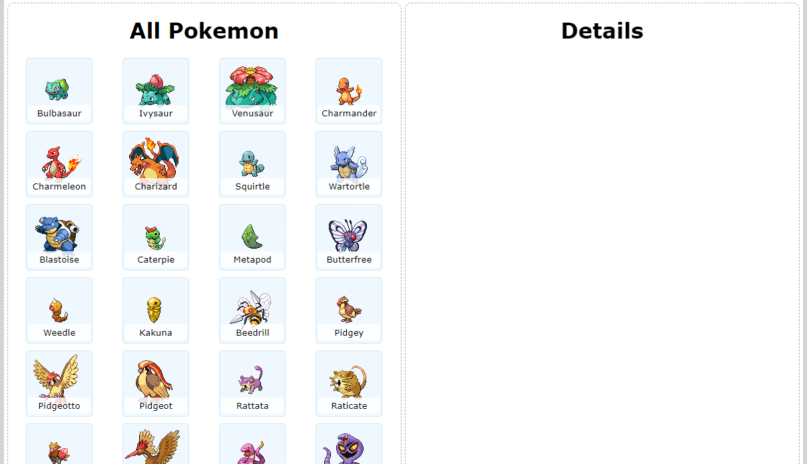
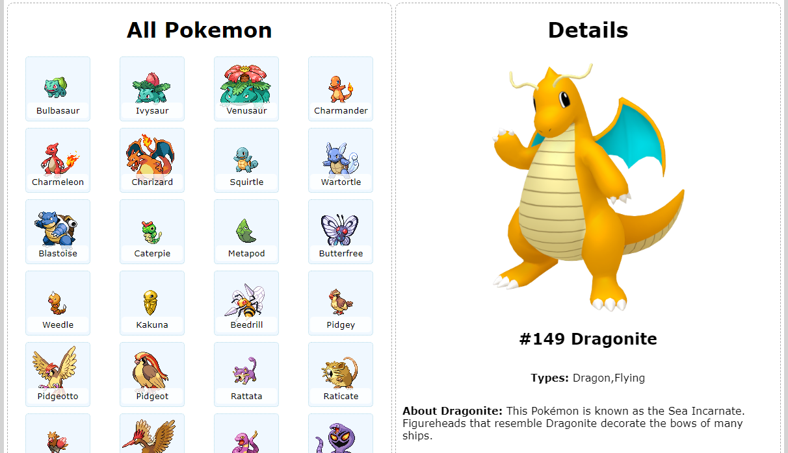
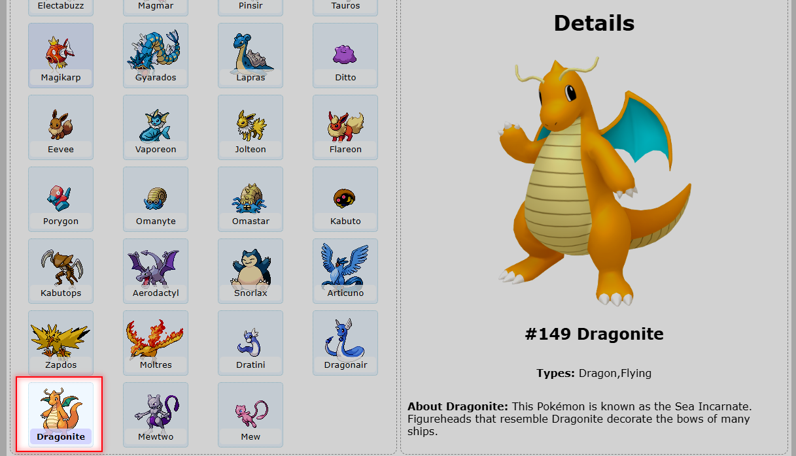
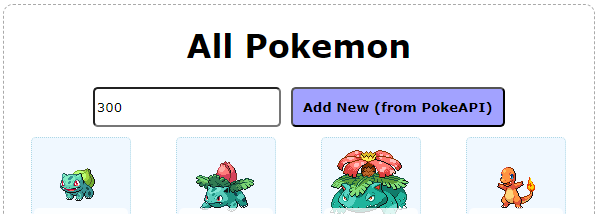
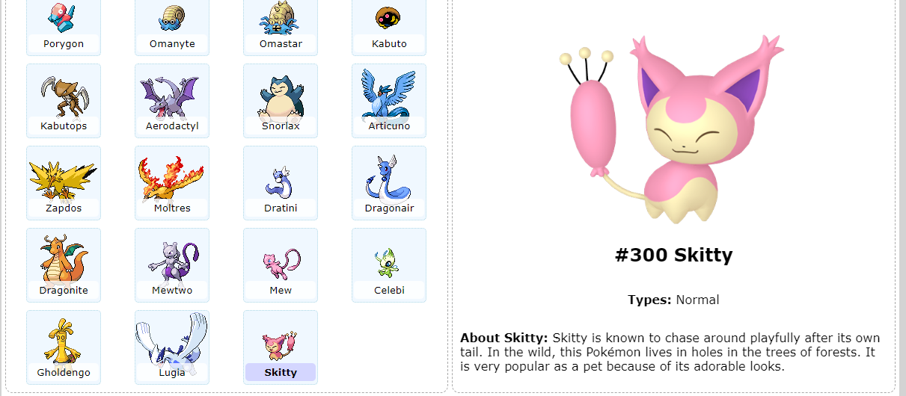

# Web Assignment 02 - Another Pokemon Page!

## Project overview

- Six tasks total, **100** marks total. Not all tasks have equal weightings - see the number of marks associated with each task below.
- Requires frontend JavaScript, backend JavaScript, and Handlebars knowledge. You will not need to implement any CSS (though make sure to structure your HTML elements correctly so that my CSS is applied properly).
- The final task is a challenging extension task. You can still receive a good grade for the assignment if you do not complete it.
- Appropriate and consistent use of Git is required throughout the assignment.

### Introduction

In this assignment, you will complete the frontend _and_ backend of a web application to display data about Pokemon. The web application's backend will maintain its own list of Pokemon info in a JSON file, and in the final task, users will be able to import data about additional Pokemon from the [PokeAPI RESTful API service](https://pokeapi.co/).

### Project structure

The project directory (with this README file) contains the following:

- `public`: Publically accessible contents.

  - `css`: Contains a site CSS file. You shouldn't need to edit this.
  - `js`: Contains a `client.js` file for your **client-side** JavaScript code. You will need to add to this.

- `src`: **Server-side** JavaScript code - a Node.js application. You will need to edit some files in this directory.

  - `db`: Contains code for reading and writing the Pokemon JSON file. You will _use_ the code provided to you, and will add to it in the final assignment task.
  - `json`: Contains the Pokemon JSON file used as a "database" (`pokemon.json`), as well as an umodified copy (`pokemon-FRESH.json`) which you can use as a backup in case you corrupt the main JSON file.
  - `routes`: Contains the routes of your Node.js application. You will need to add to `pokemon-api-routes.js` and `application-routes.js` during this assignment.
  - `index.js`: Main Node.js application entry point. You should understand this file, but do not need to edit it.

- `views:` Handlebars templates. You will need to edit `home.handlebars` for this assignment. you will not need to edit the layout file.

## Your Tasks

### Task 0: Appropriate use of Git (10 marks)

During this assignment, we expect you to make appropriate use of Git. You **must** make _at least_ one commit _per task_ below, with the results of that finished task. You may make more commits if appropriate. Whenever you do make a commit, please add a detailed commit comment so the markers know at a glance what is contained within that commit.

### Task 1: Displaying a list of Pokemon (10 marks)

Your first coding task is to modify `routes/application-routes.js` and `views/home.handlebars` to allow a list of Pokemon to be displayed when a user first loads the page.

1. In `application-routes.js`, you'll notice a single route defined, for `/`. Currently, we just render the "home" view here (i.e. `home.handlebars`). Before the call to `res.render()`, we'll want to supply the view engine with the necessary data (i.e. the list of all Pokemon). This data can be obtained by calling the `getAllPokemon()` function (located within `pokemon-db.js` - it's already been imported at the top of the file).

2. Next, we'll modify our Handlebars template to actually display the data passed to it. In the `sprite-container` div, for each Pokemon in the list, display a `<button>` element with that Pokemon's `name` and `smallImageUrl`. Specifically, a single button should be of the following format:

   ```html
   <button>
     
     <span>Pokemon's name goes here</span>
   </button>
   ```

   Make sure you get the HTML structure exactly as shown here, or else the CSS that's been provided to you won't look correct.

Once you've completed the steps above, when running your webapp and navigating to <http://localhost:3000/>, your page should look similar to the following:



Clicking the buttons won't do anything at this stage - we'll add that functionality in Task 4 below.

### Task 2: Displaying your favourite Pokemon (15 marks)

Next, we'll continue to modify `application-routes.js` and `home.handlebars` so that the "Details" section of the website is popuated when we first load the page.

1. Firstly, pick your favourite Pokemon from the list (I chose Dragonite, but you don't have to). Supply _just_ that Pokemon to your "home" view too, in addition to the list of all Pokemon which you're already supplying.

2. Now, further modify `home.handlebars` to display the new information you're providing. In the `details` div, just below the `<h1>` that's already there, display the Pokemon's `dexNumber`, `name`, `imageUrl`, `types`, and `dexEntry` appropriately, such that the end result looks like the below screenshot (but with your favourite Pokemon!).



**Hint:** In Task 4, we'll be writing _client-side_ JavaScript code to modify the content placed in the "Details" section (with info about whichever Pokemon the user clicks). Therefore, it might pay to give various HTML elements appropriate `id`s, `class` names, etc, so you can refer to them more easily from your client-side JavaScript code later on.

### Task 3: A simple API (15 marks)

The next frontend feature we'll add is the ability to change which Pokemon is displayed in the Details view by clicking on one of the buttons. But before we do that, we'll need to create an API endpoint for our frontend to talk to!

**Note about Express Routers**: Express Routers are a fantastic way to break down your Node.js / Express code into separate files, to save you from having one huge `server.js` file with all your backend code. These are explained in detail in **Module 9** of the course, but _you **do not** need an in-depth understanding of Routers to complete this task._ The details below should be sufficient.

**Note about the Router setup:** The router hierarchy has been given to you, configured as follows:

- `routes/routes.js` has been added to `index.js` (on line 29), at path `/`.
  - `routes/api/api-routes.js` has been added to `routes/routes.js` (on line 5) at path `/api`,
    - `routes/api/pokemon-api-routes.js` has been added to `routes/api/api-routes.js` (on line 4) at path `/pokemon`.

This means that any path we configure for the router in `pokemon-api-routes.js` will have `/api/pokemon` _prepended_ to it.

For example, if we add the following route to `pokemon-api-routes.js`:

```js
router.get("/hi", function (req, res) {
  // Your code here...
});
```

Then that route will be accessible via a `GET` request to <http://localhost:3000/api/pokemon/hi> when the server is running.

With this in mind, add a new route to `pokemon-api-routes.js`, such that when we make a `GET` request to <http://localhost:3000/api/pokemon/:dexNumber>, the server will respond with JSON data for the Pokemon with the given `dexNumber`. If a Pokemon with the provided `dexNumber` doesn't exist, the server will instead respond with a `404` status code.

Once implemented, you should be able to test by running your browser and navigating to your API route, trying both valid and invalid `dexNumber`s (by default, the supplied JSON file has Pokemon with numbers from `1` to `151` inclusive).

**Hints:**

- Investigate `db/pokemon-db.js` to see pre-existing functions you can use to help you.
- We want to supply the `dexNumber` in the URL, as a path parameter, otherwise known as a [route parameter](https://expressjs.com/en/guide/routing.html#route-parameters).
- Express's _response_ (`res`) object has a function called `sendStatus()`...

### (Intermediate) Task 4: Hooking up the buttons (15 marks)

Now that we have an API route to call, we'll modify our frontend code to make use of it! To do this, add _client-side_ JavaScript code (to `public/js/client.js`) so that when the page first loads, it adds a `click` event handler to all buttons you added in Task 1. When a button is clicked, a `fetch()` request will be made to the API route you developed in Task 3, requesting data about the Pokemon which was clicked. Upon receiving the response, display the returned Pokemon's data in the Details section (overwriting any Pokemon data already displayed there).

**Hint:** You will likely need some way of determining _which_ Pokemon corresponds to the button which was clicked by the user (or at least, you'll need to its `dexNumber`), so you can make the appropriate `fetch()` request. A great way to do this is to use _HTML data attributes_. Have a look at [this excellent MDN resource](https://developer.mozilla.org/en-US/docs/Learn/HTML/Howto/Use_data_attributes), and consider how you can add data attributes to the code you wrote in Task 1, in order to assist you with completing Task 4.

### (Intermediate) Task 5: Selected Pokemon (15 marks)

In this task, we'll add a visual indicator of the currently selected Pokemon, in the "All Pokemon" view.

Modify your code so that wheneve a Pokemon button is clicked, in addition to displaying that Pokemon's details on the righthand side, we will _also_ add the `selected` CSS class to the clicked button (and remove it from all other buttons). There is CSS code provided to you (in `public\css\site.css` line 102) which will style "selected" buttons differently, as shown in the highlighted portion of the screenshot below.

**Here's the trick**: When the page loads, we are already showing our favourite Pokemon's details! Therefore, we will want that Pokemon's button to be selected by default. Either the `selected` CSS class should already be on that button when the page loads, or it should be added immediately on page load by your client-side JavaScript code. Exactly how you accomplish this is up to you.

When complete, modify the paragraph below in this README to explain how you have implemented Task 5, and why you chose to do it the way that you did.

#### How I implemented Task 5

_TODO Your answer here._



### (Advanced) Task 6: Adding new Pokemon (20 marks)

For our final task, we will add a brand new _end-to-end_ (requiring elements of both frontend and backend coding) feature to our webapp, which will allow users to add data about new species of Pokemon, obtained from the [PokeAPI RESTful API service](https://pokeapi.co/).

The requirements for this feature are given here. Exactly how you implement this is up to you, as long as it meets these requirements.

**Note:** This is an _advanced_ task, and therefore it is largely up to you to research and implement as necessary (though a couple of hints are given below). There are many ways you could complete this task - it's up to you.

Once you've completed Task 6, write a short paragraph or three in the space given at the end of this README, explaining how _and why_ you have implemented it in the way that you did.

#### Requirements

Your new feature must meet the following functional requirements:

1. The frontend UI should be modified to provide a space for users to type a new Pokemon's `dexNumber`. Currently there are `1010` species of Pokemon (!!). This could be a simple text field as shown in the example screenshot below, but doesn't have to be.

   

2. There should be a button on the UI which, when clicked, will somehow result in new Pokemon data being added to `src\json\pokemon.json`, obtained from PokeAPI.

3. The newly added Pokemon should also appear as a button in the "All Pokemon" section of the webapp, and its details should immediately be shown in the "Details" section (and its button should be selected).

4. The new Pokemon's data should be _persisted_ - that is, if a user refreshes the browser, uses a different browser, or even if the server is shut down and restarted, the new Pokemon's data should still be available.

5. If the user tries to add a Pokemon which already exists in our webapp, a duplicate should not be added. Instead, some kind of error message should be displayed to indicate this (can be a simple `alert()` or something more "pretty", up to you).

6. If the user tries to add a Pokemon which doesn't exist at all (i.e. a number less than `1`, greater than `1010`, or not a number), your application should handle this case gracefully and should display an informative error message on the frontend.

7. Newly added Pokemon do not have to be in numberical order - appearing in the order they are added by the user is fine. For example, in the screenshot below, the Pokemon "Gholdengo" (number `1000`) is displayed before "Lugia" (number `249`) because it was added first.

   

8. Consider good coding practices when implementing this task. In particular, take care as to which files you are adding your code to. Make sure that it makes sense (e.g. code to modify the Pokemon "database" file probably makes sense to be put in `pokemon-db.js`...).

#### Hints & tips

This task requires a fair bit of thought, and there are many ways it could be implemented. However, here are some brief hints:

1. If you accidentally corrupt your `pokemon.json` file, or simply want to reset it, you can use the provided `pokemon-FRESH.json` file.

2. Take a look at `db\db.js` to find a function which can help you write JavaScript objects to a file, as JSON. Note that this function doesn't _format_ the JSON, so it will look ugly when opened in a text editor, but will still be perfectly valid JSON.

3. A good PokeAPI endpoint to use to obtain _most_ of the data you need is <https://pokeapi.co/api/v2/pokemon/:dexNumber>, where `:dexNumber` is the Pokemon's number. However, this does not contain any Pokedex text - you can get that from <https://pokeapi.co/api/v2/pokemon-species/:dexNumber>.

4. Both API endpoints above contain _way more_ data than you need, and are also structured quite differently. Study the documentation [here](https://pokeapi.co/docs/v2#pokemon) and [here](https://pokeapi.co/docs/v2#pokemon-species), and compare **very** carefully to the data / format you actually need for this webapp.

5. A good image to use for the buttons (`smallImageUrl`) is `pokemon.sprites.front_default`. A good image for the main image (`imageUrl`) is `pokemon.sprites.other.home.front_default` (or fallback to another image if unavailable - some pokemon pages don't contain that image).

6. Most info in PokeAPI is all lowercase. Consider whether that looks good, and how you could change it (for example, to capitalize Pokemons' names)...

7. The "Pokemon species" endpoint shown above has a property called `flavor_text_entries` which contains all Pokedex data for that Pokemon from every game. This is a great potential source of data for the required `dexEntry` property in our webapp. In my model solution, I am picking one of those entries for a Pokemon, by first filtering based on language (choosing only English ("en") entries), then picking the _last_ entry (which presumably is the most recent). You may use that strategy too, or a different one - it's up to you.

8. Sometimes, loading data from PokeAPI is a little slow. Bear that in mind when testing.

9. Test your code early and often. Don't wait until you think you've finished the whole task to begin testing. Break down the task into small, manageable chunks, and test each chunk to make sure it is correct before moving on.

10. Consider working on Task 6 in a separate _Git branch_, and only merging once it's complete. That way, if something goes wrong, you'll still have a working version of your assignment up to Task 5 to show off. If you _partially_ implement Task 6 and don't want to merge it into `main`, but still want the markers to have a look, then please **write this in your paragraph down below so they know to check your other branch**.

#### How I implemented Task 6

_TODO Your answer here._
